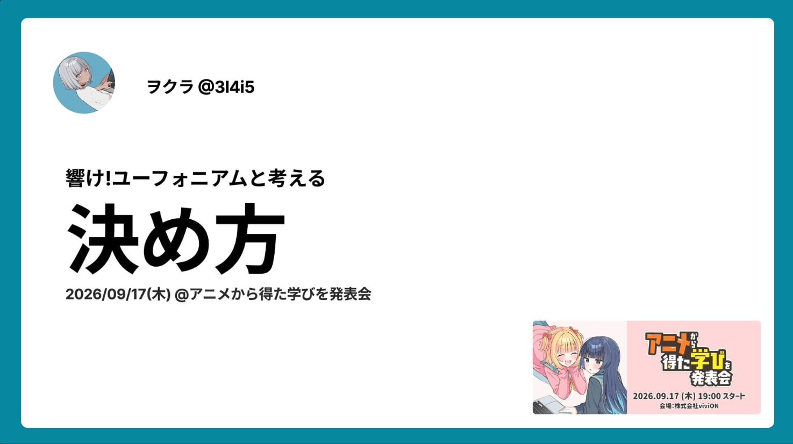

スライドは以下です

響け!ユーフォニアム　第二話　「よろしくユーフォニアム」にて、北宇治高校吹奏楽部の皆さんは、「全国大会出場」という目標を、多数決で決めました。

多数決というのはその場ですぐに答えを出すことができます。しかし、みんなでこれから向かう先を決めるのに、本当にその決め方でよかったのか？というところに疑問を持ちました。

今回の登壇は、この一連の流れについて、今一度考えてみたことについて登壇しました。

## 滝先生はズルいと思った話

今回、多数決以外にもっと良い決め方があったのではないか？というところから話がスタートしました。しかし、目標決定のプロセスを見直した結果、北宇治高校が「全国大会出場」を目標にしなかった場合、北宇治高校吹奏楽部はどうなっていたのかと考えると、おそらくあまり吹奏楽部は上手くならずに、結果が出ない形が続いていたでしょう。

滝先生は、その場で目標を決めさせました。「皆さんが納得するような決め方であれば私はどのような決め方でもいいです」と作中では発言していましたが、本当にそう思っていたのでしょうか。

また先生は、「厳しい練習で全国を目指す」か「楽しい思い出づくりで部活をするか」の二択を選ばせています。目標は本当にこの二択なのでしょうか。

改めてここの部分を見直すと、「短い時間で決断させる」ことと「片方に選びにくい選択肢を並べて選択を誘導する」こと、これによって滝先生は「厳しい練習で全国を目指す」という目標に部員全員の言質を取ることが目的だったのではないかと思ってしまいます。

「楽しい思い出づくり」の目標の方を選びにくい描写については、小説「響け!ユーフォニアム」の久美子のセリフからも伺えます

> こういう時、実は何を選ぶかはすでに決まっているのだ。大人がいる中で提示される選択肢、子供はその中で最も正しいものを選ばなくてはならない。世間的に正しいもの、社会的に正しいもの。（出典: 武田綾乃「響け！ユーフォニアム」　宝島文庫、2023年 p.54）

私は「納得のいく目標を作るには？」という観点で資料を作りましたが、滝先生の目的は「納得のいく目標」ではなく「部のレベルを上げるための言質を取るには？」という観点で声をかけていたのかもしれません。教育者だなぁ。

そう考えると、やはり大人というのはずるいですね。

そんな話をnikkieさんともお話ししていました

> 脱線ですが、滝先生はかなりやり手に見えていて
> 最初多数決にして言質を取った後、合奏で1回突き落とし、そのあと上達の魔法を使って、北宇治1人1人が自分事として部活に全国出場に向かうようにしていってるんですよね #エンジニアニメ #anime_eupho
[https://x.com/ftnext/status/2100549288380301313?s=20](https://x.com/ftnext/status/2100549288380301313?s=20)

めちゃくちゃわかるなぁ

## おわりに

久しぶりのエンジニアニメでの登壇でした。

自分があまり最近アニメを見れていなかったのもあり、登壇から離れてしまっていましたが、これからもアニメを抽象化し学びに変えていきたいと思います！

次は沼津だ。