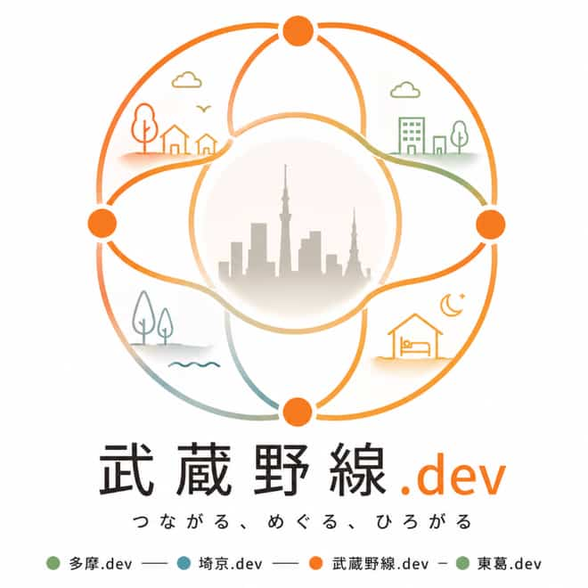
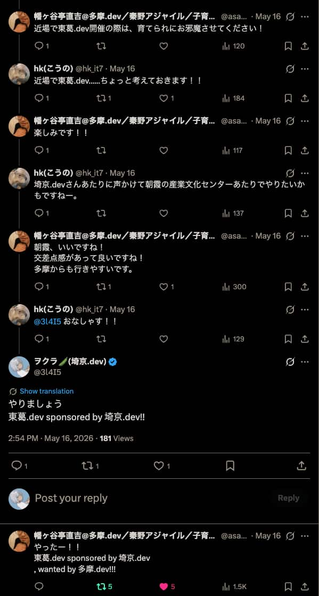
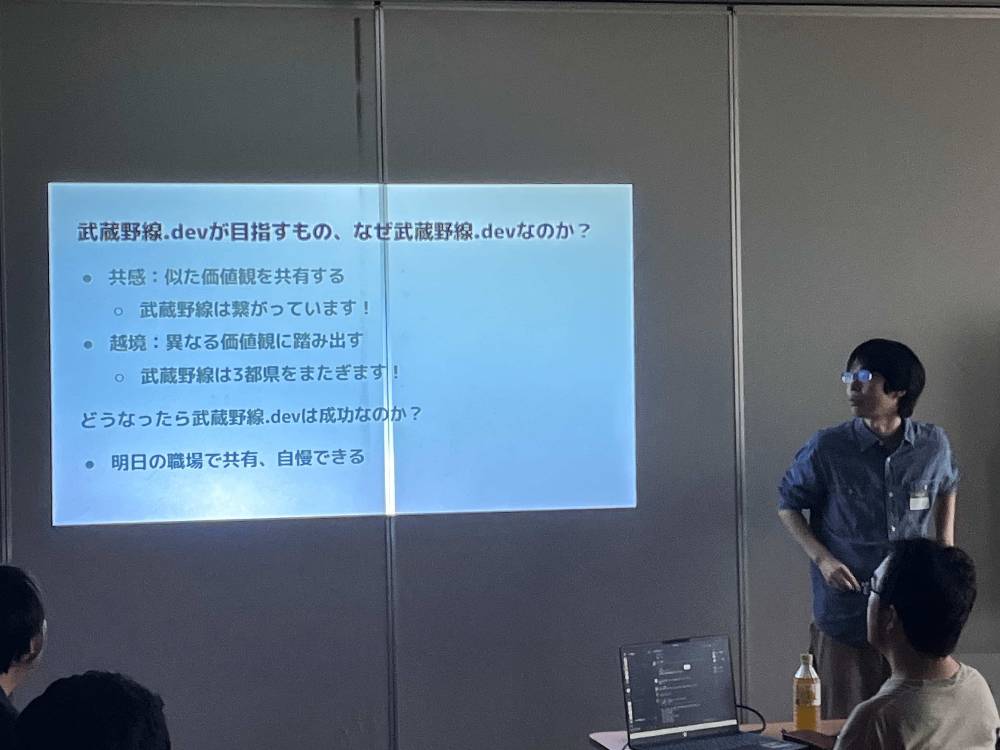
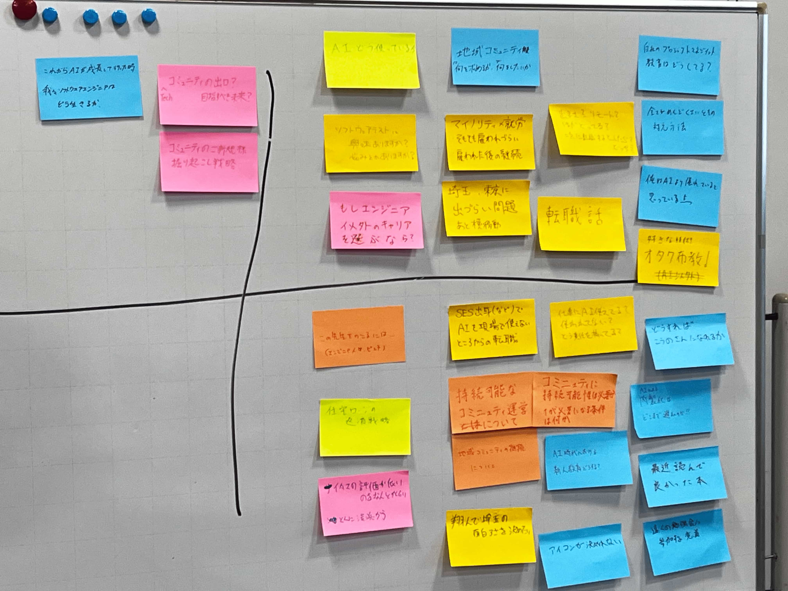
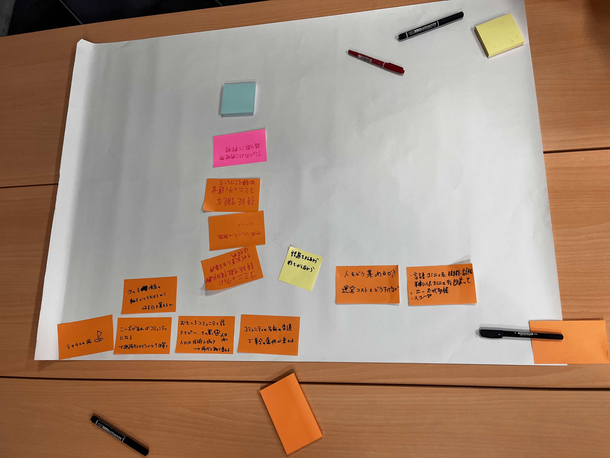
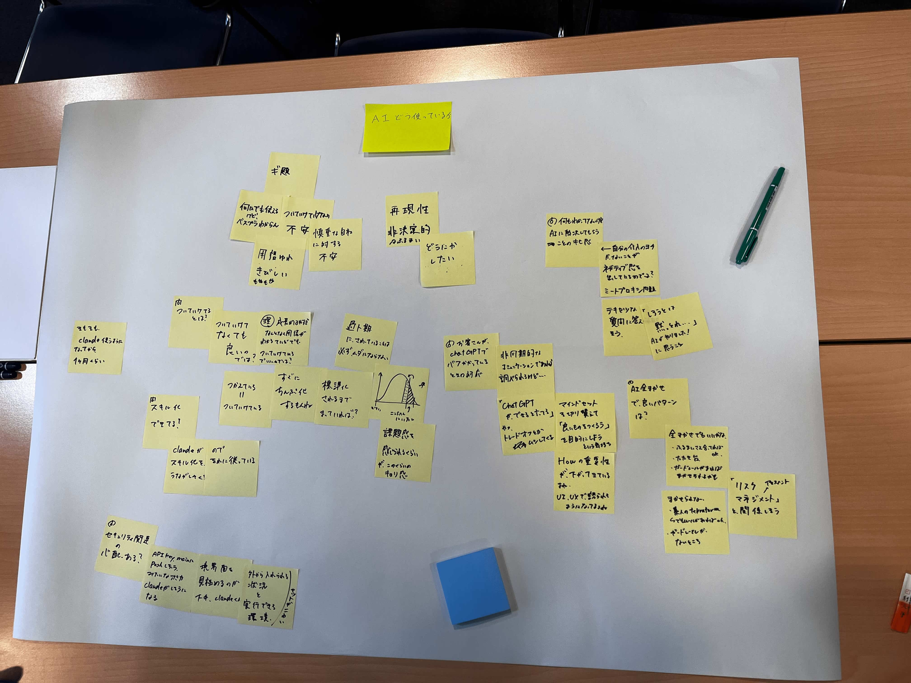
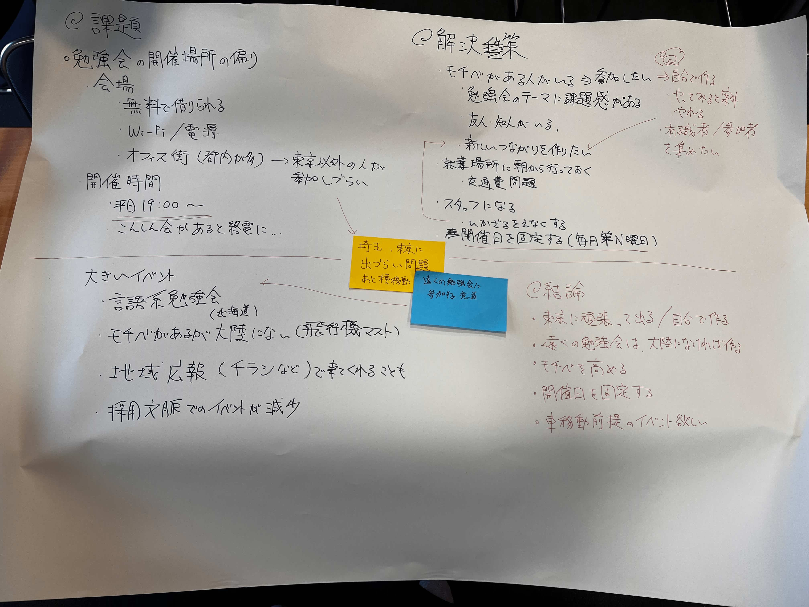

武蔵野線.devを共催しました！

このやりとりから四ヶ月！多くの人にお集まりいただいてとても感慨深いです！

私は会場の諸々など、事務的な面でお手伝いをさせていただいていました！

## 会の流れ

- オープニング
- OSTのトークテーマ出し
- OST開始（3グループ）
- それぞれのグループの話し合ったことを発表
- 延長線
- クロージング

### オープニング

こうのさんにが会の目的などを話してくれました。

目的などについて最初にしっかりと伝えるのいいなぁ。僕も真似しよう。

### OSTのトークテーマ出し

たくさんのテーマが出てきました。全部の話をしたかったですね。

僕は「地域コミュニティ"に何を求めるか" "で何をしたいか"」「これからAIが成長していった時、我々ソフトウェアエンジニアはどう生きるか」というテーマを出しました。

どう生きようかね。

実際に話すことになったテーマは「持続可能なコミュニティ運営について」「AIみんなどう使ってますか〜？」「埼玉県　東京に出ずらい問題」の三つのテーマについて話されることになりました

### それぞれの卓のお話し

#### テーブル1：　持続可能なコミュニティ運営について

テーブル1では持続可能なコミュニティ運営についてお話しされていました。

特に以下のお話しが印象的でした

- ニーズの多様化によって様々なテーマの勉強会が作られている話
- 若い方が技術コミュニティに来てくれないと、新規参入者がいなくなり、人は減っていってしまうよね　という話
- 勉強会の大規模化によって運営コストが上がってしまうという話

私も小さな勉強会運営に携わっている人間として、勉強会の持続可能性について、考えたいと思いました。

#### テーブル2: AIみんなどう使ってますか〜？

テーブル2では普段どのような形でAIを使ってますか？という話題でした。

その話に関連して、AIに対する不安についてお話をしました

- AIの発展にちゃんとついていけているか"不安"
- AIのアウトプットが正しいかどうか"不安"

あんまり詳しくない人が出してきたTerraformは、どんなに良くてもあんまり信用できないなぁ　みたいな話が出てきて面白かったです。このような極端な例から実態を探るような思考実験大好き。OSTならではの話ですね。

その流れで、リスクマネジメントの観点で、正しくリスクを評価して、どの程度であれば許容できるかどうかについて考えることが、漠然とした不安の解消につながるのでは？という話になり、かなり納得しました。

AIとの関わり方についてのお話にもなりました。AIは自分の力をエンハンスするものでしかないから、AI関連ツールの使い方ももちろん大切だけれども、自分の力を高めるのに活用しまくるのが大切なのではないか？という話に納得感がありました。

#### テーブル3: 埼玉県　東京に出ずらい問題

こちらでは、埼玉に住んでいると、平日に東京で行われる勉強会に参加するハードルが高くなるよね　というお話しが主にされていました。

結論としては、「近場で自分で作ればいい」という剛腕力結論！応援してます！

ただ、そのために協力してくれる人などを集めるためにも、モチベを高めてイベントに参加するのはいい選択肢だよねというお話をされていました。

お話の中で出てきた「開催日を固定する」というアイデアは、参加者側にも優しいとのことを聞き、埼京.devでも実践してみたいと思います。

## おわりに

ただただこうのさんの、**場をいい感じにする力**の凄まじさに感動していました。

帰りの電車で「どうしてそんなに引き出しがあるんですか？」と聞いたら、「年の功です。あと4年もすれば自動的にできるようになります」とのことだったので、頑張って4年待ってみようと思いました。

第二回もあるそうなので、その時はまた皆さんお越しください！

ではまた！
