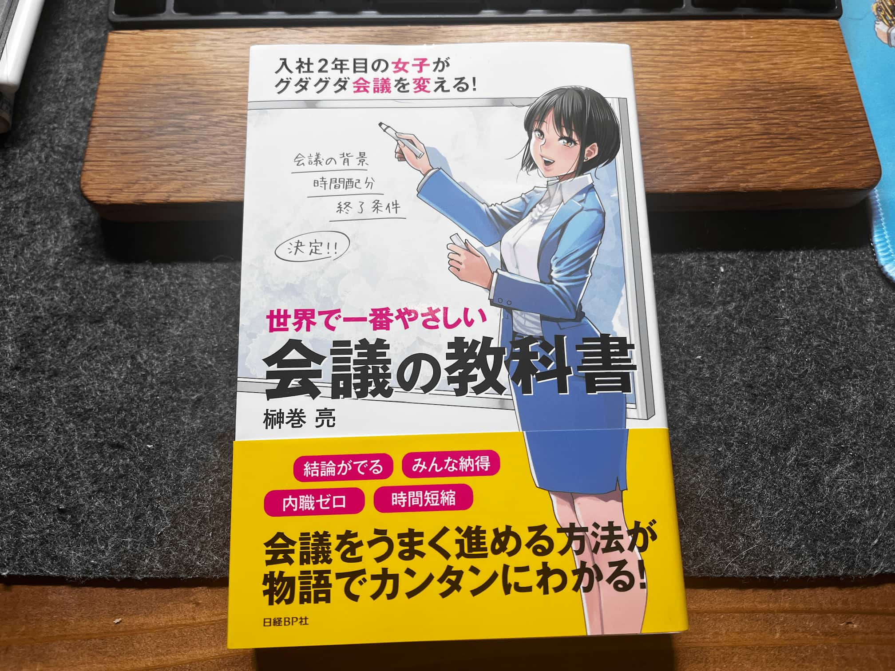

以前「ファシリテーションに課題があるのでおすすめの本を教えてください！」と呟いたところ、たくさんのおすすめ本を教えていただきました！

↓その時のツイート

[https://x.com/3l4I5/status/2099643617874973000?s=20](https://x.com/3l4I5/status/2099643617874973000?s=20)

今日はその中の一冊「世界で一番やさしい会議の教科書」を読み終えたので感想を残します。

結論だけいうと、ファシリテーションゆるふわ理解だった自分にぴったりの本でした！

## 本の感想

本自体が物語調で進んでいくため、背景や状況がとても理解しやすく、とても楽しく読むことができました。

特に、「会議に参加しているけれども、あまり価値を感じられていない」といった悩みだったり、「会議のファシリをやったことがあるけど、あんまりうまくいかない」といったような課題を持っている方に大変お勧めできると感じました。

実際にこの本では、会議自体があまり価値を感じられないと感じている主人公が、ファシリテーションのプロと共に、会議が持つ課題について相談しながら、ファシリテーターではない一人の参加者の立場から「隠れファシリテーター」として会議を改善していくというところから物語が始まります。

最終的には、隠れファシリテーターを超えて、明示的なファシリテーターとして活躍していくのですが、その過程で「ファシリテーターがいる意義」の話や、「会議で問題解決に向かうための方法」「会議の準備において重要なこと」などの話がされていました。

実践的なストーリーを通して、理想的な会議のあり方を知ることができ、自分の中でも大変腹落ちしました！

今まで私は、ファシリテーションに課題感がありながらも、とりあえずアジェンダを用意しておくだけで、当日あたふたする　みたいなファシリテーションしかできなかったので、大変学びになりました。次から会議のファシリテーションをすることになった場合に、この本で学んだことを実践してみようと思います。